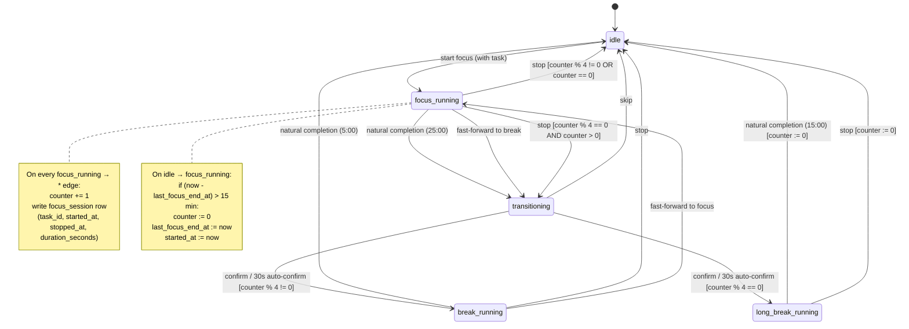

# ADR 0001 — Timer state machine

- **Status:** Accepted (subject to verification by [the canonical-rules research ticket](#research-verification))
- **Date:** 2026-08-14
- **Drives:** [Issue #3 — Document timer state machine shape](https://github.com/edrobertsrayne/pomodoro/issues/3)
- **Verified by:** [Issue #10 — Research: Pomodoro Technique canonical rules](https://github.com/edrobertsrayne/pomodoro/issues/10)

## Context

The timer controller sits at the heart of the app and gates every focus session, every break, and the cycle that connects them. Several semantic edges were unresolved before any controller could be built: how to model pause vs. running, what counts toward the long-break cycle, what happens when a focus ends in each of the three ways it can, and how much of this should survive a page reload. This ADR locks the FSM that downstream tickets will implement.

## Decisions

### No pause

Pausing a running focus is **not** a supported operation. Any interruption — internal urge, colleague, browser tab switch — is treated as a spent pomodoro: the user can `stop` (which ends the focus immediately and counts as 1 toward both actuals and the cycle counter) or `fast-forward to break` (which ends the focus immediately and counts as 1, then routes through the break prompt). Pausing-and-resuming the same focus is impossible. This collapses the state graph and matches the canonical Pomodoro Technique's stance that an interrupted pomodoro is void, not resumable.

### Cycle counter

The cycle counter ticks the **number of focuses that have been recorded** in the current cycle. It lives **in memory in the controller** (no persistence across page loads). It increments on **focus end** (any cause) — paired cleanly with the moment we write the `focus_session` row. It **resets to 0** when the gap between consecutive focus ends exceeds **15 minutes**, *or* after a long break ends.

The 15-minute gap is the threshold because anything longer than a scheduled long break (15 min) breaks the rhythm; anything shorter (including a 5-min short break) keeps the streak alive.

### Cycle counter increment on stop

Counter increments on **every** focus end — including `stop`. This means stopping the 4th focus in a cycle does push the counter to 4, and the next focus end (the 5th) makes the counter 5. The long-break check is therefore `counter > 0 && counter % 4 == 0`, evaluated **after** the increment and **before** the next transition.

### Long-break routing

A long break fires iff a focus end causes the counter to become a positive multiple of 4, **regardless of the focus's cause**. Concretely: natural completion of the 4th focus, fast-forward of the 4th focus, *and* `stop` of the 4th focus all route to the long break. Stops that don't land on a multiple of 4 route to `idle` with no break.

This is the one corner that the grilling surfaced as potentially surprising — a user who deliberately stops a focus and gets a 15-minute break prompt anyway. The trade-off is consistency with "every started focus counts" and avoiding the need for a separate counter-reset path.

### Transitioning state

`focus-running` never routes straight to a break. Any focus end that produces a break (natural completion, fast-forward, or stop on a multiple-of-4 cycle) enters a `transitioning` state showing a prompt: "Take a 5-minute break?" or "Take a 15-minute long break?". The prompt has a **30-second auto-confirm countdown** (per ADR's audio/visual style — see the notification-strategy ADR), and the user can:

- **Confirm** (or wait 30s) → enter `break-running` or `long-break-running` as appropriate
- **Skip** → enter `idle`

### Break-side controls

While in `break-running` or `long-break-running`, the user has two controls:

- **`stop`** — end the break early, return to `idle`
- **`fast-forward to focus`** — end the break early, immediately enter `focus-running` (no prompt — momentum)

Breaks cannot be paused either.

### Mid-cycle navigation

The timer controller is **not persisted mid-cycle**. Refresh, tab close, navigation away, and reload all return the controller to `idle`. Any in-flight focus session is lost — no `focus_session` row is written for abandoned focuses. The cycle counter is also lost. This matches the destination's explicit "no mid-cycle persistence" preference.

## States

| State             | Description                                                                 |
| ----------------- | --------------------------------------------------------------------------- |
| `idle`            | No session running. The user picks a task and clicks `start focus`.        |
| `focus-running`   | A 25-minute focus session is counting down against a chosen task.           |
| `transitioning`   | A focus has just ended; showing a break prompt with a 30s auto-confirm.     |
| `break-running`   | A 5-minute short break is counting down.                                    |
| `long-break-running` | A 15-minute long break is counting down.                                  |

## State diagram

## Side effects summary

| Trigger                                  | Side effects                                                 |
| ---------------------------------------- | ------------------------------------------------------------ |
| `idle → focus-running` (start focus)     | Capture `task_id`; set `started_at = now`; reset `last_focus_end_at` if stale gap; reset counter if gap > 15 min |
| `focus-running → *` (any focus end)      | Increment counter; write `focus_session` row                |
| `focus-running → transitioning`          | Snapshot counter to determine target (`break` vs `long-break`) |
| `transitioning → break-running` / `long-break-running` | Start break timer                                |
| `break-running → focus-running` (fast-forward) | Start a new focus (no break ended, no row written)       |
| `long-break-running → idle` (any end)    | Reset counter to 0                                           |

## Open verification

A separate [research ticket](https://github.com/edrobertsrayne/pomodoro/issues/10) verifies these rules against authoritative Pomodoro Technique sources — particularly the "no pause" claim and the cycle-counter rules. If that research overturns any decision here, this ADR is reopened.

## Consequences

- The `transitioning` state adds UI surface: a prompt with countdown, confirm/skip controls. Belongs in the layout-prototype ticket.
- The focus-running controller no longer needs a `paused` flag or any pause-related transitions.
- The cycle counter is recoverable only while the tab is alive. Users who close the tab between focuses always start a new cycle. Acceptable per destination.
- The `stop` action can route to either `idle` or `transitioning` depending on the counter — the controller must check the post-increment value before deciding.
