# ADR 0001 — Timer state machine

- **Status:** Accepted (subject to reopen ticket [#13](https://github.com/edrobertsrayne/pomodoro/issues/13); [#11](https://github.com/edrobertsrayne/pomodoro/issues/11), [#12](https://github.com/edrobertsrayne/pomodoro/issues/12) resolved)
- **Date:** 2026-08-14
- **Drives:** [Issue #3 — Document timer state machine shape](https://github.com/edrobertsrayne/pomodoro/issues/3)
- **Verified by:** [Issue #10 — Research: Pomodoro Technique canonical rules](https://github.com/edrobertsrayne/pomodoro/issues/10) — resolved; spawned reopens #11 (long-break length), #12 (cycle counter on stop), #13 (gap-reset threshold). See [`docs/agents/research/pomodoro-canonical-rules.md`](https://github.com/edrobertsrayne/pomodoro/blob/research/pomodoro-canonical-rules/docs/agents/research/pomodoro-canonical-rules.md) on branch `research/pomodoro-canonical-rules`.
- **Revised by:** [Issue #12 — Reopen: Decide whether interrupted pomodoros advance cycle counter](https://github.com/edrobertsrayne/pomodoro/issues/12) — resolved. Canonical model collapsed to two focus-end causes (`ring`, `stop`); ADR's prior `fast-forward to break` was an invention with no primary grounding, dissolved. `stop` now **resets** the cycle counter (not ticks, not halts): long breaks fire iff 4 *consecutive completed* pomodoros ring.

## Context

The timer controller sits at the heart of the app and gates every focus session, every break, and the cycle that connects them. Several semantic edges were unresolved before any controller could be built: how to model pause vs. running, what counts toward the long-break cycle, what happens when a focus ends in each of the two ways it can (`ring` or `stop`), and how much of this should survive a page reload. This ADR locks the FSM that downstream tickets will implement.

## Decisions

### No pause

Pausing a running focus is **not** a supported operation. The canonical Pomodoro Technique treats a started pomodoro as indivisible — per [Wikipedia citing Cirillo](https://en.wikipedia.org/wiki/Pomodoro_Technique): *"A pomodoro is indivisible; when interrupted during a pomodoro, … the pomodoro must be abandoned,"* and per [Cirillo's Core Process](https://web.archive.org/web/20230331051358/https://francescocirillo.com/products/the-pomodoro-technique): *"Work on the task until the Pomodoro® rings."* The canonical model therefore has exactly **two** focus-end causes: `ring` (the 25:00 timer hits zero, natural completion) and `stop` (any interruption — internal urge, colleague, browser tab switch, or a deliberate "end this focus now" click). There is no third "fast-forward to break" gesture; an earlier draft of this ADR invented one, but it has no canonical grounding and dissolves. Any interruption is a spent pomodoro: the user can `stop`, which ends the focus immediately, counts as 1 toward actuals, and routes to a short break (never a long break — see "Long-break routing"). Pausing-and-resuming the same focus is impossible. This collapses the state graph and is the only restatement consistent with the canonical rule.

### Cycle counter

The cycle counter ticks the **number of *consecutive completed* focuses** that have rung in the current cycle. It lives **in memory in the controller** (no persistence across page loads). It increments on **`ring`** only — natural completion. It **resets to 0** on any of: a `stop` (an interruption breaks the chain of consecutive completed pomodoros), when the gap between consecutive focus ends exceeds **15 minutes** (pending [#13](https://github.com/edrobertsrayne/pomodoro/issues/13) — the 15-min number inherited from the now-overturned 15-min long break and may yet drop entirely given `stop` now resets by the same "break-in-chain" principle), *or* after a long break ends.

The 15-minute gap threshold was originally motivated as "anything longer than a scheduled long break breaks the rhythm; anything shorter keeps the streak alive." **Note:** the long break is now 20 min (per [#11](https://github.com/edrobertsrayne/pomodoro/issues/11)), so this 15-min threshold no longer mirrors the long-break length; [#13](https://github.com/edrobertsrayne/pomodoro/issues/13) will decide whether to mirror 20 min, pick a different value, or drop the rule entirely (the now-likely outcome, since `stop` already resets the chain under the same principle that a gap would).

### Cycle counter on stop

A `stop` **resets** the cycle counter to 0. It does not tick, and it does not halt in place. The "4 consecutive completed pomodoros → long break" rule (see "Long-break routing") forces this: a halt rule would let a single later `ring` after a `stop` fire the long break (counter parked at 3 → 4), making the `stop` transparent to the long-break rhythm — contradicting "consecutive." A tick rule would route a stopped 4th focus to a long break — the corner ADR's prior grilling flagged as surprising and now dissolved. Reset is the only coherent reading: any interruption breaks the chain back to zero.

This is the only focus-end path that resets rather than increments. The intent distills to: a `stop` is the gesture that *costs* you your streak progress toward the long break. You've still done the work (1 actual, always — see "No pause"); you just haven't *completed* this pomodoro.

### Long-break routing

A long break fires iff a `ring` causes the counter to become a positive multiple of 4. `stop` **never** routes to a long break — it resets the counter and routes to a short break (via `transitioning`). The rule "long breaks occur after every fourth consecutive completed pomodoro" therefore reads cleanly: only natural completions advance the rhythm, and any stop wipes it.

This removes the corner the ADR's prior grilling surfaced as potentially surprising — a user who deliberately stops a focus and gets a long-break prompt anyway. That surprise was an unmotivated consequence of the old "every focus end ticks the counter" rule; it no longer exists. The new surprising corner — *stopping one focus short of the long break wipes your streak* — is surprising in a motivated, canonical-consistent way ("2 hours of uninterrupted work" is an explicit destination preference).

### Transitioning state

`focus-running` never routes straight to a break. Any focus end (`ring` or `stop`) enters a `transitioning` state showing a prompt: "Take a 5-minute break?" or "Take a 20-minute long break?" (the latter only on a `ring` that lands the counter on a positive multiple of 4). The prompt has a **30-second auto-confirm countdown** (per ADR's audio/visual style — see the notification-strategy ADR), and the user can:

- **Confirm** (or wait 30s) → enter `break-running` or `long-break-running` as appropriate
- **Skip** → enter `idle`

### Break-side controls

While in `break-running` or `long-break-running`, the user has two controls:

- **`stop`** — end the break early, return to `idle`
- **`fast-forward to focus`** — end the break early, immediately enter `focus-running` (no prompt — momentum)

Breaks cannot be paused either.

### Mid-cycle navigation

The timer controller is **not persisted mid-cycle**. Refresh, tab close, navigation away, and reload all return the controller to `idle`. Any in-flight focus session is lost — no `focus_session` row is written for abandoned focuses. The cycle counter is also lost. This matches the destination's explicit "no mid-cycle persistence" preference.

## States

| State             | Description                                                                 |
| ----------------- | --------------------------------------------------------------------------- |
| `idle`            | No session running. The user picks a task and clicks `start focus`.        |
| `focus-running`   | A 25-minute focus session is counting down against a chosen task.           |
| `transitioning`   | A focus has just ended; showing a break prompt with a 30s auto-confirm.     |
| `break-running`   | A 5-minute short break is counting down.                                    |
| `long-break-running` | A 20-minute long break is counting down. |

## State diagram

```mermaid
stateDiagram-v2
    [*] --> idle

    idle --> focus_running: start focus (with task)

    focus_running --> transitioning: ring (25:00) [counter += 1; counter % 4 == 0 AND counter > 0 → long break, else short break]
    focus_running --> transitioning: stop [counter := 0; short break]

    transitioning --> break_running: confirm / 30s auto-confirm [counter % 4 != 0]
    transitioning --> long_break_running: confirm / 30s auto-confirm [counter % 4 == 0]
    transitioning --> idle: skip

    break_running --> idle: natural completion (5:00)
    break_running --> idle: stop
    break_running --> focus_running: fast-forward to focus

    long_break_running --> idle: natural completion (20:00) [counter := 0]
    long_break_running --> idle: stop [counter := 0]

    note right of focus_running
      On focus_running → * edge (ring only):
        counter += 1
        write focus_session row
        (task_id, started_at, stopped_at, duration_seconds, end_cause='ring')
      On focus_running → * edge (stop):
        counter := 0
        write focus_session row
        (task_id, started_at, stopped_at, duration_seconds, end_cause='stop')
    end note

    note right of focus_running
      On idle → focus_running:
        if (now - last_focus_end_at) > 15 min:
          counter := 0
        last_focus_end_at := now
        started_at := now
    end note
```

## Side effects summary

| Trigger                                  | Side effects                                                 |
| ---------------------------------------- | ------------------------------------------------------------ |
| `idle → focus-running` (start focus)     | Capture `task_id`; set `started_at = now`; reset `last_focus_end_at` if stale gap; reset counter if gap > 15 min |
| `focus-running → *` (ring — natural 25:00)      | Increment counter; write `focus_session` row (`end_cause='ring'`) |
| `focus-running → *` (stop — interruption) | **Reset counter to 0**; write `focus_session` row (`end_cause='stop'`) |
| `focus-running → transitioning` (ring)   | Snapshot counter to determine target (`break` vs `long-break`); long-break iff counter is positive multiple of 4 after increment |
| `focus-running → transitioning` (stop)   | Target is always short break; counter already reset to 0 before this edge |
| `transitioning → break-running` / `long-break-running` | Start break timer                                |
| `break-running → focus-running` (fast-forward) | Start a new focus (no break ended, no row written)       |
| `long-break-running → idle` (any end)    | Reset counter to 0                                           |

## Open verification

Research on the canonical Pomodoro Technique rules is complete ([#10](https://github.com/edrobertsrayne/pomodoro/issues/10); findings in [`docs/agents/research/pomodoro-canonical-rules.md`](https://github.com/edrobertsrayne/pomodoro/blob/research/pomodoro-canonical-rules/docs/agents/research/pomodoro-canonical-rules.md)). Verdicts:

- **"No pause" rule** — confirmed against Cirillo (Wikipedia citing Cirillo: "a pomodoro is indivisible"; Cirillo's Core Process: "work until the pomodoro rings"). No changes; citation can be tightened in a follow-up.
- **Long break = 15 min** — **overturned and resolved**. Cirillo's archived Get Started pages and Wikipedia give **20–30 min**; [#11](https://github.com/edrobertsrayne/pomodoro/issues/11) resolved the long break to **20 min** (Cirillo's endorsed default). ADR revised in place.
- **Cycle counter increments on every focus end (incl. `stop`)** — not directly stated in any primary source; defensible extrapolation. **Resolved by [#12](https://github.com/edrobertsrayne/pomodoro/issues/12)**, which **overturned** this extrapolation: canonical Pomodoro has only two focus-end causes (`ring`, `stop`), and `stop` now **resets** the counter to 0 rather than ticking. Long breaks fire iff 4 *consecutive completed* pomodoros ring. ADR revised in place.
- **Cycle counter resets on gap > 15 min** — **not in any primary source**; the 15-min number mirrors the now-overturned long-break length. Tracked in [issue #13](https://github.com/edrobertsrayne/pomodoro/issues/13). Sharpened by #12: with `stop` now resetting by the same "break-in-chain" principle, the likely resolution is to drop the magic 15-min threshold entirely (any break in the consecutive-completed chain — `stop` or tab-close/long-walk-away — resets it alike).

#11 and #12 resolved; this ADR revised in place for the long-break length, no-pause citation, and stop-cycles-counter rule. #13 pending — further revision to come.

## Consequences

- The `transitioning` state adds UI surface: a prompt with countdown, confirm/skip controls. Belongs in the layout-prototype ticket.
- The focus-running controller no longer needs a `paused` flag or any pause-related transitions. It also no longer needs a `fast-forward to break` transition; `stop` is the only early-exit gesture, and it routes uniformly to `transitioning` (short break) with a counter reset.
- The cycle counter is recoverable only while the tab is alive. Users who close the tab between focuses always start a new cycle. Acceptable per destination.
- The `stop` action always routes to `transitioning` (short break) and always resets the counter; the controller no longer conditionally routes `stop` to `idle` vs `transitioning` based on the counter — that branch is gone. Stopping one focus short of a long break wipes the streak; this is the canonical "you didn't do 2 hours of uninterrupted work" reading and is intentional.
